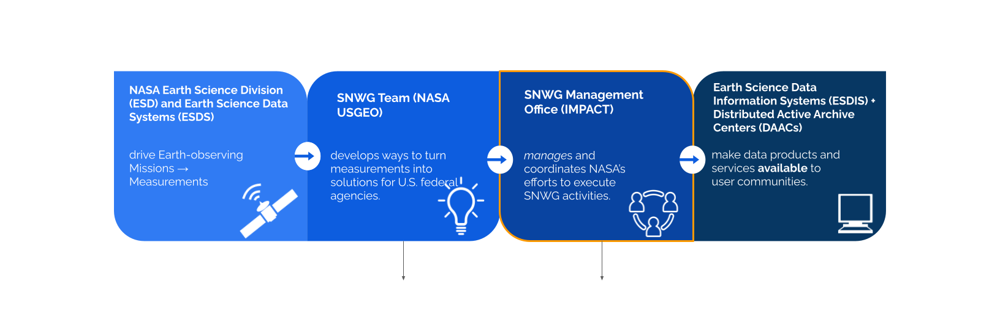
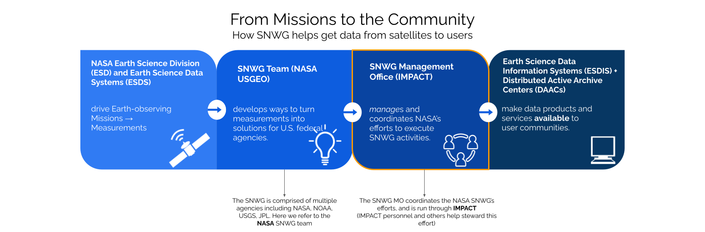

## INTERNAL NOTE TO BE REMOVED BEFORE FINAL DEPLOYMENT
- GOAL
    - single location to provide relevant, brief information that answers FAQ that new implementation teams have had. 
- Graphics:
    - **simple**, max of 3 colors. 
    - Easily digestible in a short glance. 
    - use only what is needed to provide context or improve site readability. 
- Text: 
    - Use H2 for ToC generation on all major parts. 
    - Do not attempt to explain any concepts in depth. The goal is to develop a LIGHTWEIGHT website for teams to refer to with the minimum amount of information needed to complete forms/tasks. If they want to know more, they can reach out to the SNWG MO team for further context/direction. 
    - Footnotes to links to further reading can be created[^10] 
    - do not embed slidedecks. Extract relevant information and HIGH POINTS to this site and utilize footnotes.[^11]

--------------------------------

{: .dark .w-75 .shadow .rounded-10 w='1275' h='668' }
{: .light .w-75 .shadow .rounded-10 w='1275' h='668' }

# 
Welcome to the Satellite Needs Working Group Management Office!

## What do we produce?

The SNWG MO helps various agencies produce **EOSDIS Standard Products**[^1]
+
EOS Standard Products are internally consistent, well-calibrated records of observations of the Earth's geophysical properties. They are identified and defined by EOS investigators who have been selected through a competitive peer review process to develop algorithms and software for generating products from EOS observations.
- _Products_ contain geophysical parameters and can be used for science research and application.
- _Standard_ products are validated, QA and fully documented.
- A _standard product file_ may require companion/support files to make data usable or to satisfy policy requirements. Examples include geolocation data files, browse image data, calibration and validation, higher-resolution data undergoing validation, and data quality metrics.

## Who are we?

### SNWG Implementation 

| Role                             | Name                                                              |
| :------------------------------- | :---------------------------------------------------------------- |
| SNWG Program Manager             | [Natasha Sadoff](mailto:natasha.sadoff@nasa.gov)                  |
| SNWG MO Project Manager          | [Sean Gregory](mailto:sean.p.gregory@nasa.gov)                    |
| SNWG MO Project Scientist        | [Pontus Olofsson](mailto:pontus.olofsson@nasa.gov)                |
| SNWG MO Deputy Project Manager   | [Eric Taylor](mailto:eric.s.taylor@nasa.gov)                      |
| SNWG MO Deputy Project Scientist | [Katrina Virts](mailto:katrina.s.virts@nasa.gov)                  |
| SNWG MO Systems Engineer         | [Jenny Wood](mailto:jenny.m.wood@nasa.gov)                        |
| SNWG MO Project Coordinator      | [Cherrelle Tucker](mailto:cherrelle.j.tucker@nasa.gov)            |

### SNWG Assessment

| Role                               | Name                                            |
| :--------------------------------- | :---------------------------------------------- |
| Assessment Lead                    | Katrina Virts](mailto:katrina.s.virts@nasa.gov) |
| Position 2                         | Name 2                                          |
| Position 3                         | Name 3                                          |
| Position 4                         | Name 4                                          |
| Position 5                         | Name 5                                          |

### SNWG Stakeholder Engagement

| Role                               | Name             |
| :--------------------------------- | :--------------- |
| SEP lead                           | Pontus Olofsson  |
| SEP deputy                         | Katrina Virts    |
| Position 3                         | Name 3           |
| Position 4                         | Name 4           |
| Project Coordinator                | Cherrelle Tucker |

What are our previous products?
| Cycle 1 (2016)                           | Cycle 2 (2018)                                                          | Cycle 3 (2020)           |
| :--------------------------------------- | :---------------------------------------------------------------------- | :----------------------- | 
| ADMG - _CASEI_[^2]                       | Low Latency Freeboard & Ice Thickness Products over the Great Lakes[^3] | Air Quality Products     | 
| Data Curation for Discovery              | Internet of Animals                                                     | Planetary Boundary Layer |
| Harmonized Landsat-Sentinel-2[^4]        | Global Surface Water Extent (DSWx)                                      | HLS-Vegetation Indices   |
| Commercial Smallsat Data Acquisition[^5] | Global Land Surface Disturbance and Change Detection (DIST)             | TEMPO NRT                |
|                                          | Land Surface Deformation for North America and U.S. Territories (DISP)  |                          |
|                                          | Water Quality Products                                                  |                          |

## Site Purpose
The focus of this site is on providing a simplified version of information to provide general context of the Project within the SNWG MO and to assist the Project Implementation team in completing their expected tasks.

## Site Audience
The intended audience for this site is the Solution Project Team as they progress through the various document developments, decision gates, and reporting requirements of the SNWG project lifecycle.

[^1]: [https://www.earthdata.nasa.gov/eosdis/science-system-description/eosdis-standard-products](https://www.earthdata.nasa.gov/eosdis/science-system-description/eosdis-standard-products)
[^2]: [https://impact.earthdata.nasa.gov/casei/](https://impact.earthdata.nasa.gov/casei/)
[^3]: [https://nsidc.org/data/atl10ql/versions/6](https://nsidc.org/data/atl10ql/versions/6)
[^4]: HLS link
[^5]: [https://www.earthdata.nasa.gov/esds/csda](https://www.earthdata.nasa.gov/esds/csda)

[^10]
[^11]